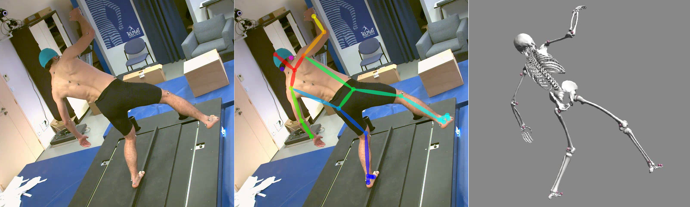

# Pose2Sim

__Code and instructions have been transferred to__ \
__[https://gitlab.inria.fr/perfanalytics/pose2sim](https://github.com/perfanalytics/pose2sim)__

This Python repository offers a way to perform a markerless kinematic analysis from multiple calibrated views as a unified workflow from an OpenPose input to an OpenSim result.

## How to cite
If you use this code or data, please cite [Pagnon et al., 2022](https://www.mdpi.com/1424-8220/22/7/2712) or [Pagnon et al., 2021](https://www.mdpi.com/1424-8220/21/19/6530).
    
    @Article{Pagnon_2022_Pose2Sim,
      AUTHOR = {Pagnon, David and Domalain, Mathieu and Reveret, Lionel},
      TITLE = {Pose2Sim: An End-to-End Workflow for 3D Markerless Sports Kinematics—Part 2: Accuracy},
      JOURNAL = {Sensors},
      YEAR = {2022},
      PUBLISHER = {Multidisciplinary Digital Publishing Institute},
      URL = {https://www.mdpi.com/1424-8220/22/7/2712}
    }

    @Article{Pagnon_2021_Pose2Sim,
      AUTHOR = {Pagnon, David and Domalain, Mathieu and Reveret, Lionel},
      TITLE = {Pose2Sim: An End-to-End Workflow for 3D Markerless Sports Kinematics—Part 1: Robustness},
      JOURNAL = {Sensors},
      YEAR = {2021},
      PUBLISHER = {Multidisciplinary Digital Publishing Institute},
      URL = {https://www.mdpi.com/1424-8220/21/19/6530},
    }
